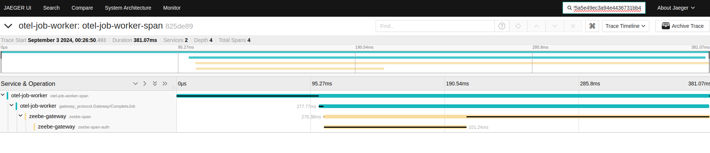

# camunda-otel

Basic example of how to integrate Opentelementry within the Camunda Platform stack. Includes an interceptor and a job-worker that implement the Otel SDK in order to provide traceability to calls between components.

## how to deploy

```
# deploy all components
bash startup.sh

# shutdown all components
bash shutdown.sh
```

## usage

```bash
#check job worker logs
$ docker logs otel-job-worker
2024/09/02 22:26:50 [trace-id: 825de89225a5e49ec3a94e4436731bb4 span-id: 0f5113fa18bee1d1] starting job 2251799813791763
2024/09/02 22:26:50 [trace-id: 825de89225a5e49ec3a94e4436731bb4 span-id: 0f5113fa18bee1d1] job 2251799813791763 completed successfully

#check zeebe-gw logs filtering by trace-id
$ docker logs zeebe | grep 825de89225a5e49ec3a94e4436731bb4

2024-09-02 22:26:50.598 [Context: {spanId=536951fddd2a423b, traceFlags=01, traceId=825de89225a5e49ec3a94e4436731bb4}] [] [grpc-executor-0] INFO  org.camunda.otel.interceptors.AuthInterceptor - starting auth-interceptor...
2024-09-02 22:26:50.598 [Context: {spanId=536951fddd2a423b, traceFlags=01, traceId=825de89225a5e49ec3a94e4436731bb4}] [] [grpc-executor-0] INFO  org.camunda.otel.interceptors.AuthInterceptor - doing authorization stuff...
2024-09-02 22:26:50.699 [Context: {spanId=536951fddd2a423b, traceFlags=01, traceId=825de89225a5e49ec3a94e4436731bb4}] [] [grpc-executor-0] INFO  org.camunda.otel.interceptors.AuthInterceptor - auth process finished!
```

### jaeger dashboard

